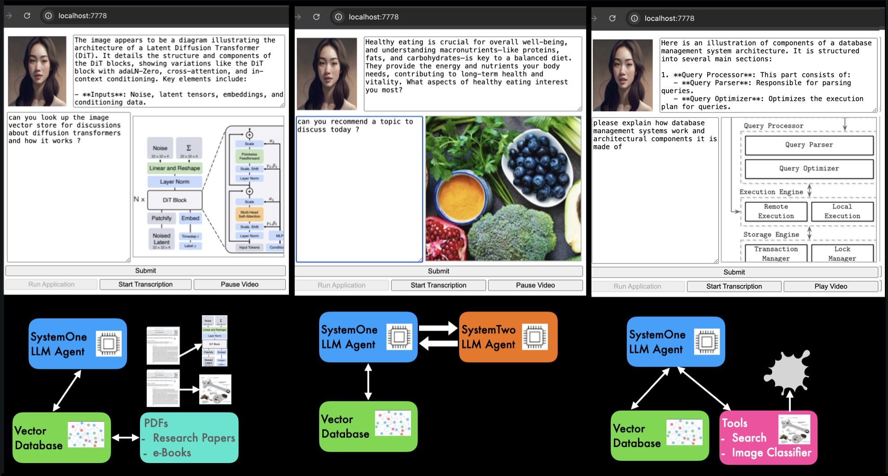

## Conversational AI Agent
#### - *Extracts PDF figures and images for analysis and conversation with LLM*
#### - *Drive goal driven conversations using System 1 (automatic) and System2 (systematic) Planning*
#### - *Consults external data sources for up-to-date information*

This repository contains code for a generative AI driven conversational application with the following features:

- Allows users to study images and diagrams stored in PDF files through conversations driven by an LLM, employing various Retrieval Augmented Generation (RAG) techniques, vector databases, PDF conversion to markup files and images files, and a custom MarkDown Text/Image Splitter.

- Implements System 1 and System 2 Thinking via Agents, where a System 2 agent creates and implements a plan for a conversation with users on some particular topic, employing LangGraph library and adaptive system/context prompting.

- Implements mechanisms for Large Language Model (LLM) Tool Calling and Output Parsing/Formatting, allowing the application to collect data from API services, i.e. search engines, stock price services, services to multi-modal foundational models, etc.

